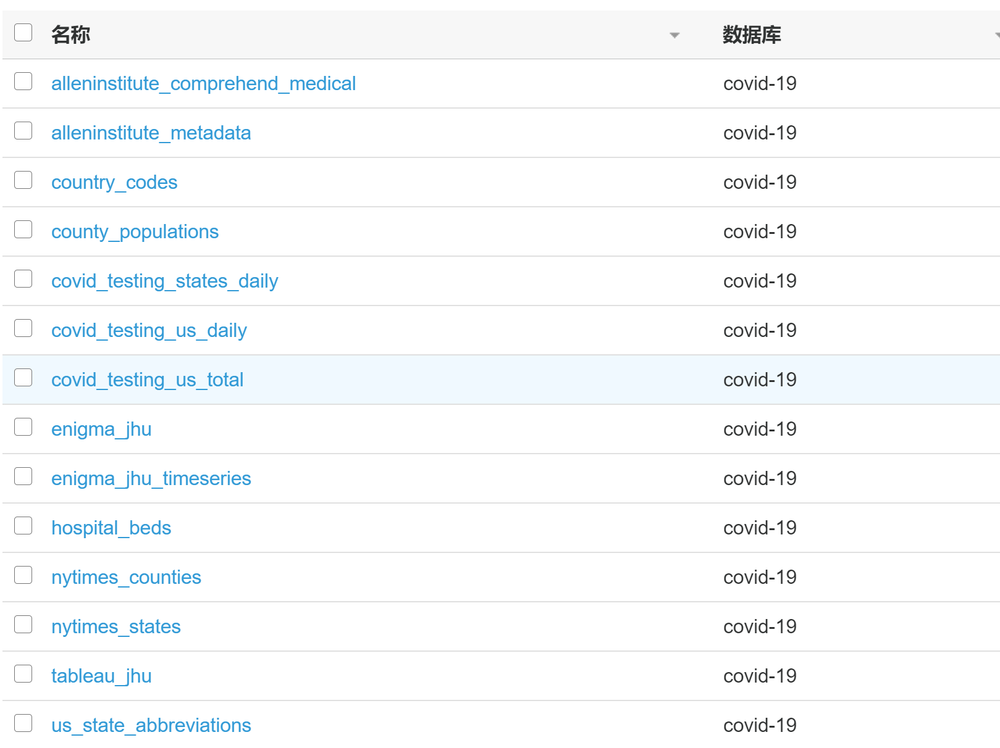

# 用于分析新冠肺炎 COVID-19 的 AWS 公共数据湖大数据示例

[toc]

该数据湖由公共可读的 Amazon S3 存储桶（s3://covid19-lake）中的数据组成。 本文章显示了如何通过AWS Glue 数据目录为该数据设置表格定义，并且使用cloudformation将所有的表结构一次过生成，以将其公开给分析引擎。 然后使用无服务器 SQL 查询引擎 Amazon Athena 查询 AWS COVID-19 数据。最后利用Apache Superset 进行可视化分析和仪表盘展示。

[COVID-19 AWS 公共数据湖介绍](https://aws.amazon.com/cn/blogs/big-data/a-public-data-lake-for-analysis-of-covid-19-data/)

| S3 桶路径	| 描述	| 数据源| 关键字段 |
| :-----| :-----| :-----| :-----|
|s3://covid19-lake/enigma-jhu/ | 全球新冠肺炎 (COVID-19) 数据 | 约翰.霍普金斯大学 | 累计确诊 / 死亡 / 治愈 / 地理信息 / 更新时间

|表名|描述|数据源|
| :-----| :-----| :-----|
|enigma_jhu|该数据集跟踪了世界各省，州和国家中已确认的COVID-19病例，并细分了美国的县级。本次实验将会重点实验该数据集|约翰.霍普金斯大学|
|hospital_beds|美国的病床数据及其利用情况|Definitive Healthcare|
|country_codes|美国国家代码||
|county_populations|根据最近的人口普查数据查找每个县的人口表||
|us_state_abbreviations|美国州简写||
|nytimes_states|美国州一级的COVID-19病例数据|NY Times|
|nytimes_counties|美国村一级的COVID-19病例数据|NY Times|
|covid_testing_states_daily|美国各州总测试每日趋势|COVID Tracking Project|
|covid_testing_us_daily|美国总测试每日趋势|COVID Tracking Project|
|covid_testing_us_total|美国总测试|COVID Tracking Project|
|alleninstitute_metadata|从CORD-19研究挑战数据集中提取的论文中的元数据。 “ sha”列表示报道ID，它是数据湖中报道的文件名。|Allen Institute for AI|


## 同步AWS COVID-19 公共数据湖数据到您账号的 S3 桶(对于后续的深入研究需要全部数据的情况)

### 浏览数据集
```bash
# AWS S3 命令行
aws s3 ls s3://covid19-lake/ --profile us-east-1
```
### 同步数据集到AWS国内区域
使用工具 [amazon-s3-resumable-upload toolkit](https://github.com/aws-samples/amazon-s3-resumable-upload) 同步AWS COVID-19 公共数据湖数据到您账号的 S3 桶

命令步骤
```bash
# 请先安装 AWS CDK 然后由 CDK部署。CDK 文档可参照官网：
https://docs.aws.amazon.com/cdk/latest/guide/getting_started.html

# 克隆工具
git clone git@github.com:aws-samples/amazon-s3-resumable-upload.git
cd amazon-s3-resumable-upload/serverless/enhanced-lambda-jobsender
pip install -r requirements.txt

export AWS_DEFAULT_REGION=us-east-1

## 手工配置 System Manager Parameter Store， 新增参数: 名称：s3_migration_credentials, 层级: Standard, 类型: SecureString, 参数值：
{
  "aws_access_key_id": "your_aws_access_key_id",
  "aws_secret_access_key": "your_aws_secret_access_key",
  "region": "cn-northwest-1"
}

## 编辑目录下 AWS CDK app.py 文件，设置 S3 桶信息
bucket_para = [{
    "src_bucket": "covid19-lake",  # The bucket in US
    "src_prefix": "enigma-jhu",
    "des_bucket": "covid-19-raw-data-zhy", # The bucket in China
    "des_prefix": ""
}, {
    "src_bucket": "covid19-lake",  # The bucket in US
    "src_prefix": "enigma-jhu-timeseries",
    "des_bucket": "covid-19-raw-data-zhy",  # The bucket in China
    "des_prefix": ""
}, {
    "src_bucket": "covid19-lake",
    "src_prefix": "static-datasets",
    "des_bucket": "covid-19-raw-data-zhy",
    "des_prefix": ""
}]

StorageClass = 'STANDARD'
alarm_email = "alarm_your_email@email.com"

# 部署工具扫描和同步目标桶与源桶数据
cdk deploy --profile ${AWS_GLOBAL_PROFILE} --outputs-file "stack-outputs.json"
```
也可以使用一台主机两边通过aws s3 sync的方式进行（注意，aws的s3cli不支持源与目标的profile不一致，所以需要先下载再上传.如果是本次实验，可以使用这里的[数据集](dataset/rawdata.zip)

## 通过 AWS Glue 数据目录浏览数据
### 创建一个 AWS Glue 爬虫 以自动爬取S3桶数据，创建表定义和填充 AWS Glue 数据目录

1. 根据文档 [Congfiure Glue Crawlers](https://docs.aws.amazon.com/glue/latest/dg/crawler-configuration.html) 创建一个名称为 `public-covid-19` 的 AWS Glue 爬虫程序 

- 将数据存储点配置到S3存储桶 `covid-19-raw-data-zhy`


- 配置输出为 `covid19` AWS Glue 数据目录的数据库表

注意设置: `Create a single schema for each S3 path` 为 `true`


- `public-covid-19` AWS Glue 爬虫程序总览


2. 执行`public-covid-19` AWS Glue 爬虫程序

- 选择 `public-covid-19` AWS Glue 爬虫程序并点击 `Run Crawler`
- AWS Glue 爬虫程序状态变为 `Starting`
- 等待AWS Glue 爬虫程序执行完毕，并且状态变为 `Ready`
- `public-covid-19`将创建 `covid19` 数据库下的2张表 


### 检查由 AWS Glue 爬虫程序生成的数据目录

例如，以下屏幕快照显示了包含约翰.霍普金斯大学新冠肺炎COVID-19 全球数据表的元数据。

名称为enigma-jhu 数据表跟踪了世界各省，州和国家中确诊，治愈和死亡的COVID-19病例，并细分到了美国的州县级。


### 对于下载了全部数据集的情况，AWS提供了一个[Cloudformation](script\CovidLakeStack.template.json)可以方便快速的爬取所有的表。
转换前只需要将里面的存储桶的文件进行相应修改即可。



## 通过 Amazon Athena 查询数据

- 该查询按时间返回由county_region过滤器细分的确诊、治愈、死亡和现存确诊病例总数，这里时间采用`2020-04-19`
```sql
-- 2020-04-19 total confirmed, recovered, deaths, active
SELECT
    SUM(confirmed) as total_confirmed, SUM(recovered) as total_recovered, SUM(deaths) as total_deaths, SUM (confirmed-recovered-deaths) as total_active
FROM 
    "covid19"."enigma_jhu"
WHERE
    last_update like '2020-04-19%';
    
-- 2020-04-19 with confirmed, recovered, deaths, active group by country_region queryed against parquet format data
SELECT
    SUM(confirmed) as total_confirmed, SUM(recovered) as total_recovered, SUM(deaths) as total_deaths, SUM (confirmed-recovered-deaths) as total_active, country_region
FROM 
    "covid19"."enigma_jhu"
WHERE
    last_update like '2020-04-19%'
GROUP BY country_region ORDER BY total_confirmed DESC;

-- 2020-04-19 with confirmed, recovered, deaths, active group by country_region queryed against json format data
SELECT 
    SUM(confirmed) as total_confirmed, SUM(recovered) as total_recovered, SUM(deaths) as total_deaths, SUM (confirmed-recovered-deaths) as total_active,country_region
FROM 
    "covid19"."enigma_jhu"
WHERE
    cast(from_iso8601_timestamp(last_update) as date) = date('2020-04-19')
GROUP BY country_region ORDER BY total_confirmed DESC ;
```

- 该查询返回过去7天按美国州县分类的确诊病例数的增长

```sql
SELECT 
    fips, admin2, province_state, confirmed, 
      last_value(confirmed) over (partition by fips order by last_update) - first_value(confirmed) over (partition by fips order by last_update) as growth_count,
      first_value(last_update) over (partition by fips order by last_update desc) as most_recent,
      last_update
FROM  
    "covid19"."enigma_jhu"
WHERE 
    cast(from_iso8601_timestamp(last_update) as date) > now() - interval '7' day AND country_region = 'US'

- 该查询返回美国的每个州的床位数及确诊数的关系
select 
    sum(b.num_licensed_beds) beds,sum(e.confirmed) confirmed,b.county_name 
from 
    covid19.hospital_beds b, covid19.enigma_jhu e
where 
    b.county_name  = e.province_state 
group by b.county_name ;
```

## 使用EMR进行数据处理

### 安装配置EMR并使用Hive进行查询
1. 访问EMR页面，点击创建集群按钮进入集群创建页面

2.	点击转到高级选项(注：通过高级选项可以选择需要的大数据平台版本。)
  
3.	配置EMR的版本，并选择实验中需要软件的发行版,t同时选中使用Glue Data Catalog设置，这样可以快速的使用之前glue导入的数据表结构。
  
4.	启动一个单节点集群，核心实例和任务实例个数为0
  为了实验的简洁，这里采用单节点集群模式。配置集群时，选择之前创建的VPC和相应的子网。主实例选择m4.large机型。


5.	选择登录机器的密钥，创建集群


当集群变成等待状态，说明集群已经创建成功。
6.	设置安全组，允许从本地登录主实例并使用ssh工具进行登录


7. 在EMR中使用HIVE查询数据库信息，查询的语句可以参考上面athena的语句。


## 使用Redshift进行数据处理
### 创建一个 AWS Glue ETL作业，将 Json 转换为 Parquet 格式
为了提高查询性能并节省成本，我将创建一个 AWS Glue ETL 作业，将 Json 转换为 Apache Parquet 格式, Parquet与Redshift结合的优势，可以参考[【在生产中结合使用 Amazon Redshift Spectrum、Amazon Athena 和 AWS Glue 与 Node.js】](https://amazonaws-china.com/cn/blogs/china/big-data-using-amazon-redshift-spectrum-amazon-athena-and-aws-glue-with-node-js-in-production/)


1. 在 Glue -> ETL 中添加工作任务，任务名称 `covid19_json2parquet`, 请确保打开 `Job bookmark`


2. 选择 `covid19.enigma_jhu_json` 表作为数据源


3. 创建一个新表，指向 S3桶位置 s3://covid-19-output-data-zhy/enigma_jhu_parquet


4. ETL作业将自动把 Json 格式的所有字段映射为 Parquet 格式，这里我们手动修改 `last_update` 字段类型为 timestamp


5. 运行作业，并确保执行成功完成。

对于持续的数据，可以考虑使用lambda将s3的文件在上传的时候就自动转换为parquet。

### 配置外部schema，使Redshift可以直接访问Glue创建的数据表。

```
# 在Redshift中执行之前，需要给redshift赋予相关s3及athena的权限。

create external schema covid19 from data catalog 
database 'covid19' 
iam_role 'arn:aws-cn:iam::577676832205:role/redshiftuser'
create external database if not exists;
```

### 使用Redshift进行查询
```
SELECT 
    SUM(confirmed) as total_confirmed, SUM(recovered) as total_recovered, SUM(deaths) as total_deaths, SUM (confirmed-recovered-deaths) as total_active,country_region
FROM 
    "covid19"."enigma_jhu_parquetenigma_jhu_parquet"
WHERE
    last_update like '2020-04-19%'
GROUP BY country_region ORDER BY total_confirmed DESC ;
```

## 使用Superset 进行可视化展示和定义仪表板

### 在AWS上安装Superset

- [Apache Superset official document](https://superset.apache.org/)
- [Apache Superset installation](https://superset.apache.org/installation.html)

### 启动docker
- [Dockerfile 样板](script/Superset/Dockerfile)
- [docker-compose.yml](script/Superset/docker-compose.yml)
```bash
# ssh to EC2 Amazon Linux 2 m5.xlarge or m5.2xlarge instance
sudo yum update -y

# install python3 gcc
sudo yum install -y python3 libpq-dev python3-dev
sudo yum install -y gcc gcc-c++

# add following into ~/.bashrc
echo "export PATH=/usr/local/bin:$PATH" >> ~/.bashrc
echo "alias python=python3" >> ~/.bashrc
echo "alias pip=pip3" >> ~/.bashrc
source ~/.bashrc
python --version

# install docker
sudo yum -y install docker
sudo usermod -a -G docker ec2-user
sudo systemctl start docker
sudo systemctl status docker
sudo systemctl enable docker
sudo chmod 666 /var/run/docker.sock
docker ps

# install docker-compose
sudo curl -L "https://github.com/docker/compose/releases/download/1.25.4/docker-compose-$(uname -s)-$(uname -m)" -o /usr/local/bin/docker-compose
sudo chmod +x /usr/local/bin/docker-compose
sudo ln -s /usr/local/bin/docker-compose /usr/bin/docker-compose
docker-compose --version

# docker run superset
sudo yum install -y git curl
git clone https://github.com/apache/incubator-superset/
cd incubator-superset
# you can run this command everytime you need to start superset now(this step takes times):
docker-compose up

docker logs --follow <container-id>
docker-compose exec superset bash

# Access the web ui
ssh -i myKey.pem -L 8088:localhost:8088 ec2-user@EC2_IP
#ssh -L 8088:localhost:8088 -i ~/.ssh/ruiliang-lab-key-pair-us-east1.pem ec2-user@34.232.48.10
http://localhost:8088 
login by admin:admin

# Superset can display maps using Mapbox. Get the API key of Mapbox and set it to MAPBOX_API_KEY.
add MAPBOX_API_KEY=mapboxapikey to ./incubator-superset/docker/.env
add MAPBOX_API_KEY = get_env_variable("MAPBOX_API_KEY") to ./incubator-superset/docker/pythonpath_dev/superset_config.py
```

## Quick Configuration
| database  | pypi package | SQLAlchemy URI prefix |
| :-------- | :-------- | :-------- | 
| Amazon Athena | pip install "PyAthenaJDBC>1.0.9" --upgrade --user | awsathena+jdbc:// |
| Amazon Athena | pip install "PyAthena>1.2.0" --upgrade --user | awsathena+rest:// |
| Amazon Redshift | pip install sqlalchemy-redshift --upgrade --user | redshift+psycopg2:// |
| PostgreSQL    | pip install psycopg2 OR pip install psycopg2-binary | postgresql+psycopg2:// |

```bash
# When you start from docker, add the connectors by add `jre` and `pip install and AWS China region Athena connection URI handling in Dockerfile`

user root
RUN apt-get update && apt-get install -y default-jre

RUN pip install "PyAthenaJDBC>1.0.9" \
    && pip install "PyAthena>1.2.0" \
    && pip install sqlalchemy-redshift \
    && pip install psycopg2
RUN mv /usr/local/lib/python3.6/site-packages/pyathenajdbc/sqlalchemy_athena.py /usr/local/lib/python3.6/site-packages/pyathenajdbc/sqlalchemy_athena.py.global
RUN curl -o /usr/local/lib/python3.6/site-packages/pyathenajdbc/sqlalchemy_athena.py https://raw.githubusercontent.com/liangruibupt/covid_19_report_end2end_analytics/master/script/china-region-pyathenajdbc-sqlalchemy_athena.py

# Restart superset after installation
docker-compose build
docker-compose up
```

### 数据准备
- Superset `World_Map` 视图不能将源数据中 `US` 缩写识别为 `United States`，因此我做了一个映射。同时增加一列为日期的方便superset进行读取。
- 计算了现存确认列,
```sql
CREATE TABLE enigma_jhu_parquet_country as 
  SELECT "fips", "admin2", "province_state", 
      CASE "country_region"
      WHEN 'US' THEN 'United States'
      -- ...any other translation you would like to add here
      ELSE "country_region"
      END AS "country_region",
      "combined_key", "last_update", "latitude", "longitude", 
      "confirmed", "deaths", "recovered", (confirmed-recovered-deaths) as "active", to_date(substr(t.last_update,1,10),'yyyy-mm-dd') as update_date
from (
select t.*
from "covid19"."enigma_jhu" t)
```

- Superset `Country_Map` 视图需要 `province_state` 字段满足 `ISO 3166-2 编码要求的区域/省/州` 格式，因此针对 `United States` 数据我重新做了州县缩写映射
[ISO 3166-2 编码说明](https://en.wikipedia.org/wiki/ISO_3166-2:US)
```sql
CREATE TABLE enigma_jhu_parquet_state as 
  SELECT "fips", "admin2", "province_state", 
      CASE "country_region"
      WHEN 'US' THEN 'United States'
      -- ...any other translation you would like to add here
      ELSE "country_region"
      END AS "country_region",
      "last_update", "latitude", "longitude", 
      "us_state_confirmed", "us_state_deaths", "us_state_recovered", (us_state_confirmed-us_state_recovered-us_state_deaths) as "us_state_active",
      concat('US-',"abbreviation") as "us_state_abbreviation"
from (
SELECT t.fips, t.admin2, t.province_state, t.country_region, t.last_update, t.latitude, t.longitude, last_value(t.confirmed) over (partition by t.fips order by t.last_update) as us_state_confirmed, last_value(t.deaths) over (partition by t.fips order by t.last_update) as us_state_deaths, last_value(t.recovered) over (partition by t.fips order by t.last_update) as us_state_recovered, s.*
from "covid19"."enigma_jhu_parquet" t, "covid19"."us_state_abbreviations" s 
where t.province_state = s.state and t.country_region = 'US')

```

### 仪表盘示例

1. 过去一天世界确诊，恢复，死亡和现存确诊人数


2. 过去一天按国家/地区列出的活跃病例的世界地图，以及过去一天中前30个活跃病例最多的国家/地区列表


3. 最近90天内按日期划分的全球已确诊和活跃病例


4. 过去一天中按州列出的美国活跃病例分布，以及上周时间段按日期列出的前10名活跃病例最多的州


### 附录- Superset dashboard 查询语句
- 过去一天世界确诊，恢复，死亡和现存确诊人数
```sql
SELECT sum("confirmed") AS "sum(confirmed)"
FROM "enigma_jhu_parquet"
WHERE "last_update" >= from_iso8601_timestamp('2020-04-19T00:00:00.000000')
  AND "last_update" < from_iso8601_timestamp('2020-04-20T00:00:00.000000')
ORDER BY "sum(confirmed)" DESC;


SELECT sum("recovered") AS "sum(recovered)"
FROM "enigma_jhu_parquet"
WHERE "last_update" >= from_iso8601_timestamp('2020-04-19T00:00:00.000000')
  AND "last_update" < from_iso8601_timestamp('2020-04-20T00:00:00.000000')
ORDER BY "sum(recovered)" DESC;

SELECT sum("deaths") AS "sum(deaths)"
FROM "enigma_jhu_parquet"
WHERE "last_update" >= from_iso8601_timestamp('2020-04-19T00:00:00.000000')
  AND "last_update" < from_iso8601_timestamp('2020-04-20T00:00:00.000000')
ORDER BY "sum(deaths)" DESC;

SELECT SUM(confirmed-recovered-deaths) AS "sum(confirmed-recovered-deaths)"
FROM "enigma_jhu_parquet"
WHERE "last_update" >= from_iso8601_timestamp('2020-04-19T00:00:00.000000')
  AND "last_update" < from_iso8601_timestamp('2020-04-20T00:00:00.000000')
ORDER BY "sum(confirmed-recovered-deaths)" DESC;
```

- 过去一天按国家/地区列出的活跃病例的世界地图
```sql
SELECT "country_region" AS "country_region",
       SUM(confirmed-recovered-deaths) AS "sum(confirmed-recovered-deaths)"
FROM "enigma_jhu_parquet_country"
WHERE "last_update" >= from_iso8601_timestamp('2020-04-19T00:00:00.000000')
  AND "last_update" < from_iso8601_timestamp('2020-04-20T00:00:00.000000')
GROUP BY "country_region"
ORDER BY "sum(confirmed-recovered-deaths)" DESC
LIMIT 10000;
```

- 过去一天中前30个活跃病例最多的国家/地区列表
```sql
SELECT "country_region" AS "country_region",
       sum("active") AS "sum(active)",
       sum("recovered") AS "sum(recovered)",
       sum("deaths") AS "sum(deaths)"
FROM "enigma_jhu_parquet_country"
WHERE "last_update" >= from_iso8601_timestamp('2020-04-19T00:00:00.000000')
  AND "last_update" < from_iso8601_timestamp('2020-04-20T00:00:00.000000')
GROUP BY "country_region"
ORDER BY "sum(active)" DESC
LIMIT 30;
```

- 最近90天内按日期划分的全球已确诊和活跃病例
```sql
SELECT date_trunc('day', CAST("last_update" AS TIMESTAMP)) AS "__timestamp",
       sum("active") AS "sum(active)",
       sum("confirmed") AS "sum(confirmed)"
FROM "enigma_jhu_parquet_country"
WHERE "last_update" >= from_iso8601_timestamp('2020-01-21T00:00:00.000000')
  AND "last_update" < from_iso8601_timestamp('2020-04-20T00:00:00.000000')
GROUP BY date_trunc('day', CAST("last_update" AS TIMESTAMP))
ORDER BY "sum(active)" DESC
LIMIT 50000;
```

- 过去一天中按州列出的美国活跃病例分布
```sql
SELECT "us_state_abbreviation" AS "us_state_abbreviation",
       sum("us_state_active") AS "sum(us_state_active)"
FROM "enigma_jhu_parquet_state"
WHERE "last_update" >= from_iso8601_timestamp('2020-04-19T00:00:00.000000')
  AND "last_update" < from_iso8601_timestamp('2020-04-20T00:00:00.000000')
  AND "country_region" = 'United States'
GROUP BY "us_state_abbreviation"
ORDER BY "sum(us_state_active)" DESC
LIMIT 50000;
```

- 上周时间段按日期列出的前10名活跃病例最多的州
```sql
SELECT "province_state" AS "province_state",
       date_trunc('day', CAST("last_update" AS TIMESTAMP)) AS "__timestamp",
       sum("us_state_active") AS "sum(us_state_active)"
FROM "enigma_jhu_parquet_state"
JOIN
  (SELECT "province_state" AS "province_state__",
          sum("us_state_active") AS "mme_inner__"
   FROM "enigma_jhu_parquet_state"
   WHERE "country_region" = 'United States'
     AND "last_update" >= from_iso8601_timestamp('2020-04-13T00:00:00.000000')
     AND "last_update" < from_iso8601_timestamp('2020-04-20T00:00:00.000000')
   GROUP BY "province_state"
   ORDER BY "mme_inner__" DESC
   LIMIT 10) AS "anon_1" ON "province_state" = "province_state__"
WHERE "last_update" >= from_iso8601_timestamp('2020-04-13T00:00:00.000000')
  AND "last_update" < from_iso8601_timestamp('2020-04-20T00:00:00.000000')
  AND "country_region" = 'United States'
GROUP BY "province_state",
         date_trunc('day', CAST("last_update" AS TIMESTAMP))
ORDER BY "sum(us_state_active)" DESC
LIMIT 100;
```

## 后续

### 使用spark进行emr的处理
### 使用sagemaker进行预测
### 增量数据在仪表盘的更新